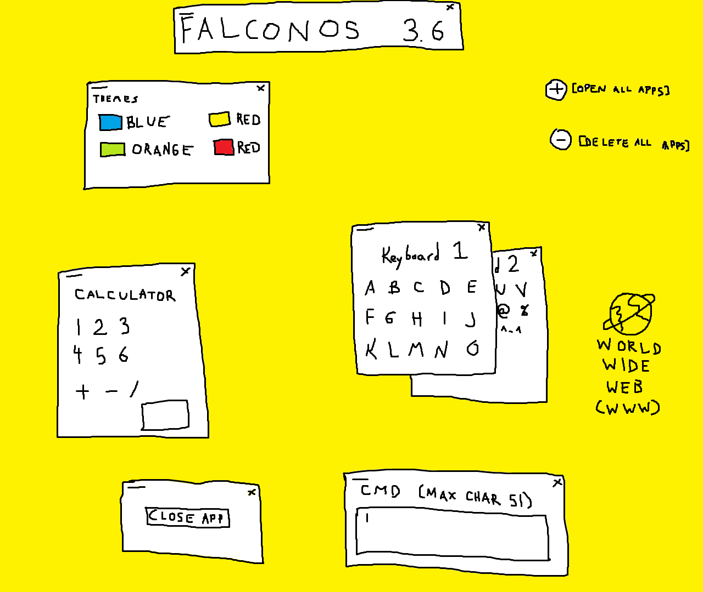

falconos
========

falconos (fal-co-nos) is a hobby OS I'm using to learn and experiment with.  It's mainly used to follow tutorials I find online and mess around with ideas before I try to implement it "better" in aphOS. A lot of code and ideas will come from the places listed below.

Here's a mockup that was commissioned for me and is my target for the falconos GUI:

Tutorials and Docs
------------------

* [Writing an OS in Rust](http://os.phil-opp.com/)
* [Bare Metal Rust](http://www.randomhacks.net/bare-metal-rust/)
* [Operating Systems: Three Easy Pieces](http://pages.cs.wisc.edu/~remzi/OSTEP/)
* [intermezzOS](https://intermezzos.github.io/)
* [The little book about OS development](https://littleosbook.github.io/)
* [Bran's Kernel Development](http://www.osdever.net/bkerndev/Docs/title.htm)
* [DOS and BIOS info](http://www.techhelpmanual.com/2-main_menu.html)
* [Writing a Memory Allocator](http://dmitrysoshnikov.com/compilers/writing-a-memory-allocator/)
